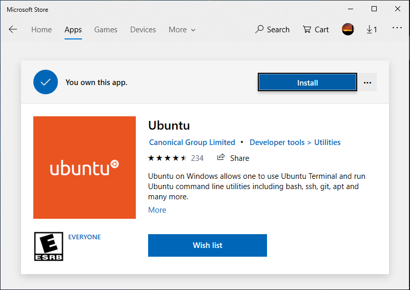

# How to Install Linux Bash Shell on Windows 10

### Step 1: Enable Windows subsytem for Linux
```PowerShell
Enable-WindowsOptionalFeature -Online -FeatureName Microsoft-Windows-Subsystem-Linux
```
- Run PowerShell as administrator and run the above command
- confirm when prompted
- reboot...

### Step 2: Download a Linux system from Windows store
* Search for Linux in Windows 10 Store
* Downlaod and Install the distribution you want from Windows Store (I picked Ubuntu)
 

## Step 3: Launch Unbuntu (from you start menu)
* after initialising, it will ask for unix username and password

## enjoy your Linux subsystem
